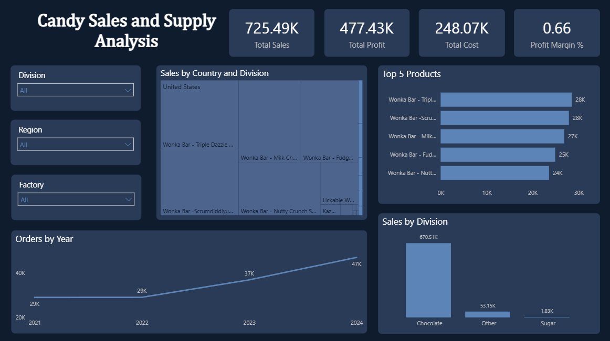
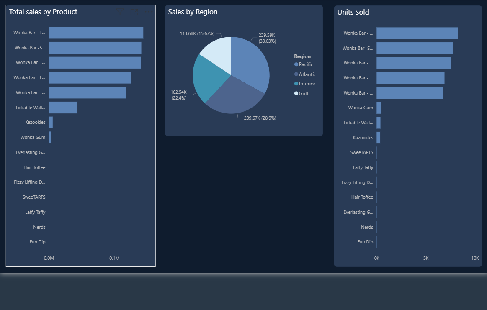
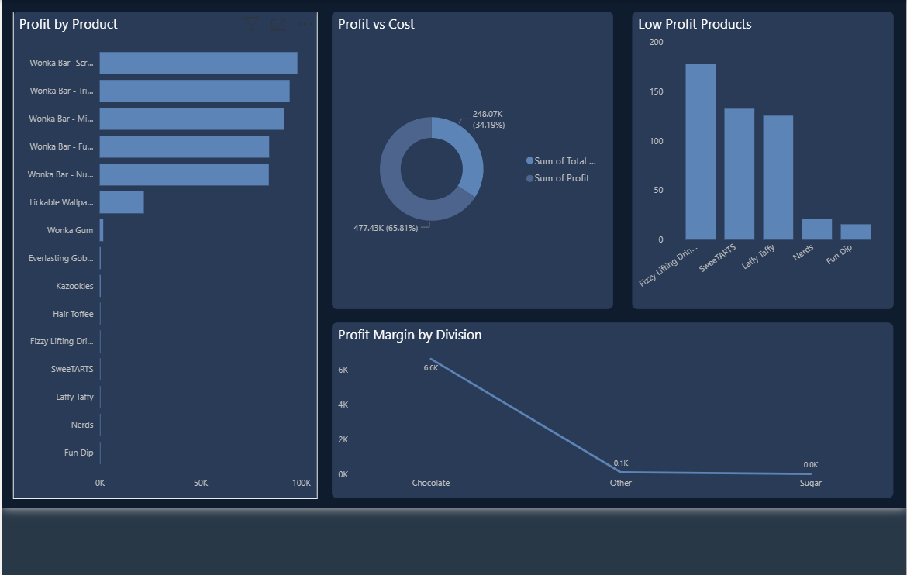
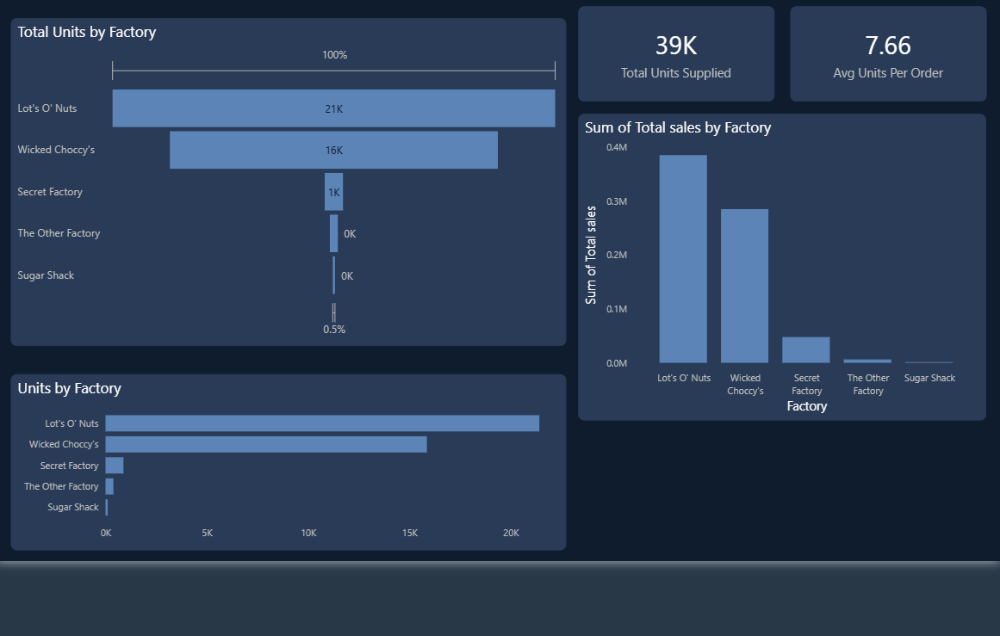
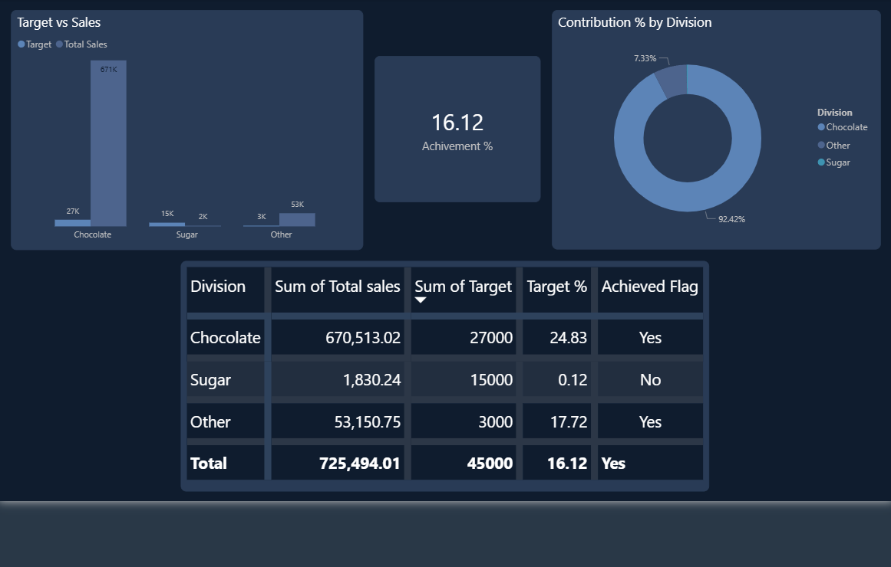

# Candy_sales_and_supply_chain_dashboard
Data analytics project using Power BI to explore candy sales, supply chain metrics, and actionable business insights.

📊 Project Overview

This project presents an interactive Candy Sales and Supply Chain Dashboard built using Power BI. It provides insights into sales performance, product profitability, regional distribution, factory supply, and target achievement.

The dashboard helps analyze business performance, product demand, supply chain efficiency, and profit trends, enabling better decision-making.

Dataset Summary
Covers sales, cost, and supply chain data
Key Fields:
Product Name
Division (Chocolate, Sugar, Other)
Region
Factory
Units Sold
Total Sales
Cost
Profit
Target

📌 Dashboard Features
🔹 Overview Page
Total Sales → 725.49K
Total Profit → 477.43K
Total Cost → 248.07K
Profit Margin → 0.66
Filters:
Division
Region
Factory

🔹 Sales Analysis

📦 Total Sales by Product
Highlights top-performing candy products
Wonka Bars dominate sales

🌍 Sales by Region
Regions include:
Pacific
Atlantic
Interior
Gulf
Pacific region contributes highest sales

📊 Sales by Division
Chocolate division generates maximum revenue
Sugar division contributes the least

📈 Orders Trend
Orders increased steadily from 2021 to 2024
Shows business growth over time

🔹 Profit Analysis

💰 Profit by Product
Wonka products generate highest profits
Some products contribute very low profit

⚖️ Profit vs Cost
Profit is significantly higher than cost
Indicates strong business margins

📉 Low Profit Products
Products like:
Fizzy Lifting Drinks
SweetARTS
Laffy Taffy
Need attention for improvement

🔹 Supply Chain Analysis

🏭 Units by Factory
Top factories:
Lot’s O’ Nuts
Wicked Choccy’s
Major contributors to supply

📦 Total Units Supplied
39K units supplied overall
📊 Sales by Factory
Lot’s O’ Nuts generates highest sales
Other factories contribute less
🔹 Target vs Achievement
Achievement Rate → 16.12%
Chocolate division achieved targets
Sugar division underperformed

📊 Contribution by Division
Chocolate → ~92% contribution
Other → ~7%
Sugar → very low contribution
📈 Key Insights
💡 Business Performance
Total Sales: 725.49K
Strong profitability with high margins

📊 Product Insights
Wonka products are top performers
Some low-performing products need optimization

🌍 Regional Insights
Pacific region leads sales
Opportunity to grow in other regions

🏭 Supply Chain Insights
Few factories dominate production
Need balanced distribution across factories

🎯 Target Performance
Overall target achievement is low
Requires improvement in sales strategy

🛠 Tools Used
Power BI – Dashboard & Visualization
Excel – Data Source
Data Analysis – KPI tracking, trends, and performance insights

✅ Conclusion

This dashboard provides a complete view of sales, profitability, and supply chain performance in the candy business.

It helps in:

Identifying top-performing products
Improving low-profit areas
Optimizing supply chain operations
Tracking business targets

This project demonstrates how Power BI transforms raw business data into actionable insights.

## 🖼 Dashboard Preview

